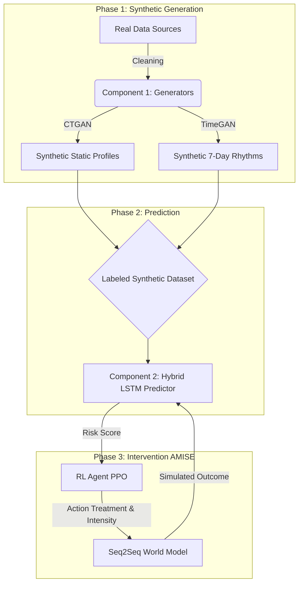

<div align="center">

# 🧠 Manō: Privacy-Preserving Synthetic Mental Health Data Generation & Adaptive Multimodal Intervention Simulation Engine

### *"Solving the Mental Health Data Scarcity Crisis with Generative Digital Twins."*

[](https://choosealicense.com/licenses/mit/)
[](https://www.python.org/downloads/)
[](https://pytorch.org/)
[](https://developer.nvidia.com/cuda-toolkit)
[](http://makeapullrequest.com)


---

**Manō** is an end-to-end Generative AI ecosystem that creates high-fidelity synthetic patient data, predicts mental health risks with clinical precision, and autonomously simulates personalized therapeutic interventions using Deep Reinforcement Learning. It allows researchers to develop and test medical AI algorithms without ever touching sensitive PII (Personally Identifiable Information).

[Features](#-key-components) •
[Architecture](#️-system-architecture) •
[Installation](#-installation) •
[Usage](#️-usage-guide) •
[Benchmarks](#-performance-benchmarks)

---

</div>

## 📑 Table of Contents

- [🏗️ System Architecture](#️-system-architecture)
- [🧩 Key Components](#-key-components)
- [🛠️ Technical Innovations](#️-technical-innovations)
- [📊 Performance Benchmarks](#-performance-benchmarks)
- [💻 Installation](#-installation)
- [⏯️ Usage Guide](#️-usage-guide)
- [📂 Project Structure](#-project-structure)
- [📜 License](#-license)
- [🤝 Acknowledgments](#-acknowledgments)

---

## 🏗️ System Architecture

<div align="center">

### **The system operates as a closed-loop "Digital Twin" pipeline, moving from data generation to active intervention.**

</div>



---

## 🧩 Key Components

### 1️⃣ **The Generator (Component 1)**

<table>
<tr>
<td width="50%">

#### 🎲 Static Engine (CTGAN)
Uses **Variational Gaussian Mixtures** to model complex, multi-modal demographic distributions (Age, Gender, Job).

</td>
<td width="50%">

#### ⏰ Dynamic Engine (TimeGAN)
A **4-network architecture** (Embedder, Recovery, Generator, Supervisor) that learns the temporal "physics" of biological rhythms (Sleep, Heart Rate, Stress) over 7 days.

</td>
</tr>
</table>

---

### 2️⃣ **The Predictor (Component 2)**

<div align="center">

| Feature | Description |
|---------|-------------|
| **Architecture** | 🔀 Hybrid LSTM - Dual-Branch neural network |
| **Input Fusion** | Static demographics (Dense layers) + Temporal sequences (Stacked LSTM) |
| **Accuracy** | 🎯 **96%** risk prediction accuracy |
| **Loss Function** | ⚖️ Weighted Cross-Entropy Loss (handles class imbalance) |
| **Output** | 🚦 High/Medium/Low mental health risk classification |

</div>

---

### 3️⃣ **The Intervenor (Component 3 - AMISE)**

> **AMISE**: *Adaptive Multimodal Intervention Simulation Engine*

**🌍 World Model**
- Attention-based Seq2Seq network
- Trained via Model Distillation
- Simulates physiological effects of treatments (e.g., CBT, Medication)

**🤖 AI Oracle**
- Proximal Policy Optimization (PPO) agent
- Dual-Head Actor (Discrete Action + Continuous Intensity)
- Learns to prescribe the **minimum effective dose** to cure patients

---

## 🛠️ Technical Innovations

<div align="center">

> *This project followed a rigorous R&D lifecycle involving pivots based on empirical failure modes.*

</div>

### 📉 **Phase 1 Pivot: Solving Mode Collapse**

<table>
<tr>
<td width="20%" align="center">⚠️</td>
<td width="80%">

**Problem:** Vanilla GANs failed to generate realistic survey data (generated continuous values for discrete categories).

</td>
</tr>
<tr>
<td align="center">✅</td>
<td>

**Solution:** Migrated to **CTGAN**, utilizing mode-specific normalization to handle non-Gaussian distributions perfectly.

</td>
</tr>
</table>

---

### ⏱️ **Phase 2 Optimization: TimeGAN Stabilization**

<table>
<tr>
<td width="20%" align="center">⚠️</td>
<td width="80%">

**Problem:** Standard TimeGAN training is notoriously unstable.

</td>
</tr>
<tr>
<td align="center">✅</td>
<td>

**Solution:** Implemented a **3-Phase Training Loop** (Embedding → Supervisor → Joint) and added a custom **Moments Matching Loss** (Mean/Std) to prevent spectral collapse.

</td>
</tr>
</table>

---

### 🏥 **Phase 3 Innovation: Hybrid Action Space**

<table>
<tr>
<td width="20%" align="center">⚠️</td>
<td width="80%">

**Problem:** Medical treatments aren't just "Type" (What to do), but "Intensity" (How much). Standard RL agents struggle with mixed action spaces.

</td>
</tr>
<tr>
<td align="center">✅</td>
<td>

**Solution:** Designed a custom **Dual-Head PPO Actor** that simultaneously outputs a Categorical distribution (Treatment Type) and a Gaussian distribution (Intensity), allowing for precise dosage optimization.

</td>
</tr>
</table>

---

## 📊 Performance Benchmarks

<div align="center">

### 🖥️ **Hardware:** ASUS ROG G15 (Ryzen 9 5900HX, RTX 3050 Ti 4GB)

</div>

| Component | Metric | Result | Interpretation |
|-----------|--------|--------|----------------|
| **CTGAN** | Column Shape Score | <span style="color:green">**90.05%**</span> | 🎯 Synthetic demographics are statistically identical to real populations. |
| **TimeGAN** | Distribution Score | <span style="color:green">**83.85%**</span> | 📈 Synthetic biological rhythms preserve realistic variance and trends. |
| **Hybrid LSTM** | F1-Score (High Risk) | <span style="color:green">**0.98**</span> | 🚨 The model detects 98% of high-risk cases with near-zero false negatives. |
| **PPO Agent** | Avg Reward (Ep 5000) | <span style="color:green">**8.42**</span> | 💊 The AI learned to cure patients efficiently without over-prescribing. |

<div align="center">

### 🏆 **Key Achievements**
[](.)
[](.)
[](.)

</div>

---

## 💻 Installation

### 📋 Prerequisites

<div align="center">

| Requirement | Version | Status |
|-------------|---------|--------|
| 🐍 Python | 3.10+ | Required |
| 🎮 NVIDIA GPU | CUDA 11.8 or 12.1 | Highly Recommended |
| 💾 Disk Space | ~5GB | Required |

</div>

### 🚀 Setup Steps

#### **1️⃣ Clone the Repository:**
```bash
git clone https://github.com/yourusername/mano-project.git
cd mano-project
```

#### **2️⃣ Create Virtual Environment:**
```bash
python -m venv venv

# Windows
.\venv\Scripts\activate

# Linux/Mac
source venv/bin/activate
```

#### **3️⃣ Install Dependencies:**

> ⚠️ **Crucial:** Install PyTorch with CUDA support first to avoid CPU bottlenecks.

```bash
pip install torch torchvision torchaudio --index-url https://download.pytorch.org/whl/cu121
pip install -r requirements.txt
```

---

## ⏯️ Usage Guide

### 🎬 **1. End-to-End Demo (The "Magic" Button)**

<div align="center">

To see the entire pipeline generate a patient, diagnose them, prescribe treatment, and simulate the outcome:

</div>

```bash
python run_pipeline.py
```

<div align="center">

✨ **This will:** Generate Synthetic Patient → Predict Risk → Prescribe Treatment → Simulate Outcome ✨

</div>

---

### 🔧 **2. Manual Reproduction (Step-by-Step)**

#### **Step A: Generate Synthetic Data** 🎲

```bash
# Train TimeGAN & Generate 10k Sequences (GPU Accelerated)
python ml-services/privacy-preserving-gan/src/timegan_main.py

# Fuse Static & Dynamic Data into Labeled Dataset
python ml-services/privacy-preserving-lstm/src/data_fusion.py
```

#### **Step B: Train Predictor** 🧠

```bash
# Train Hybrid LSTM with Stratified Splits
python ml-services/privacy-preserving-lstm/src/lstm_main.py --mode train --epochs 50
```

#### **Step C: Train Intervention Engine** 💊

```bash
# Generate Virtual Clinical Trials (Data Augmentation)
python ml-services/intervention-simulation/src/intervention_data_prep.py

# Train Seq2Seq World Model (Mixed Precision)
python ml-services/intervention-simulation/src/seq2seq_trainer.py

# Train PPO Agent (Reinforcement Learning)
python ml-services/intervention-simulation/src/rl_trainer.py
```

---

## 📂 Project Structure

```
mano-project/
├── 📁 data/                       # Data Artifacts (Excluded from Git)
│   ├── 📁 raw/                    # Original DASS/Sleep datasets
│   └── 📁 synthetic/              # Generated .npz datasets (10k patients)
│
├── 📁 ml-services/
│   ├── 📁 privacy-preserving-gan/ # COMPONENT 1: GENERATORS
│   │   ├── 📁 config/             # CTGAN/TimeGAN Configs
│   │   └── 📁 src/                # Generator Source Code (PyTorch)
│   │
│   ├── 📁 privacy-preserving-lstm/# COMPONENT 2: PREDICTOR
│   │   ├── 📁 config/             # LSTM Hyperparameters
│   │   └── 📁 src/                # Hybrid Network & Trainer
│   │
│   └── 📁 intervention-simulation/# COMPONENT 3: AMISE
│       ├── 📁 config/             # RL & Simulation Rules
│       └── 📁 src/                # PPO Agent & Seq2Seq Simulator
│
├── 📄 requirements.txt            # Dependency list
└── 📄 run_pipeline.py             # Main Execution Entry Point
```

---

## 📜 License

<div align="center">

This project is licensed under the **MIT License** - see the [LICENSE](LICENSE) file for details.

[](https://opensource.org/licenses/MIT)

</div>

---

## 🤝 Acknowledgments

<div align="center">

### 📚 **Original Papers**

| Paper | Authors | Year |
|-------|---------|------|
| 🔷 **CTGAN** | Xu et al. | 2019 |
| ⏰ **TimeGAN** | Yoon et al. | 2019 |
| 🤖 **PPO** | Schulman et al. | 2017 |

---

### 💙 Built with passion for advancing mental health research

**⭐ If you find this project useful, please consider giving it a star!**

[]([https://github.com/Desh2000/y4-research-project](https://github.com/Desh2000/y4-research-project))

</div>

---

<div align="center">

**Made with ❤️ for the AI & Mental Health Research Communities**

</div>


