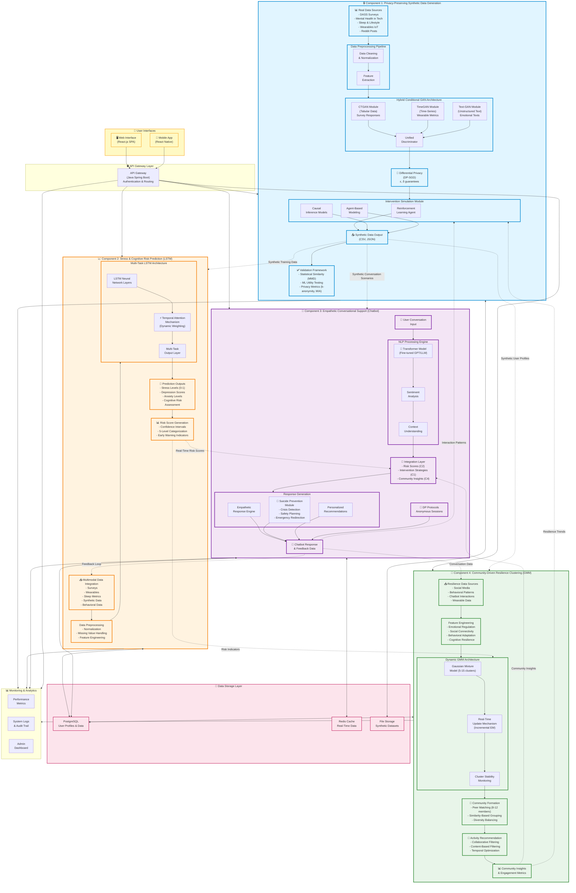

#  Manō: An End-to-End Generative AI Ecosystem for Personalized Mental Health Support

<div align="left">


### *End-to-End Generative AI for Synthetic Patient Data, Risk Prediction, Conversational Support & Community Resilience*

[](https://choosealicense.com/licenses/mit/)
[](https://www.python.org/downloads/)
[](https://pytorch.org/)
[](.)
[](.)

---

## 📖 Table of Contents
- [High-Level System Overview](#-high-level-system-overview)
- [The Core Problem & Our Solution](#-the-core-problem--our-solution)
- [System Architecture](#️-system-architecture)
- [Component Breakdown](#-component-breakdown)
- [Lifecycle & Historical Evolution](#-lifecycle--historical-evolution)
- [Failures & Pivots](#-failures--pivots-technical-decisions)
- [Data Pipeline](#-data-pipeline)
- [Models & Algorithms](#-models--algorithms)
- [Technical Innovations](#-technical-innovations)
- [Performance Benchmarks](#-performance-benchmarks)
- [Installation & Usage](#-installation--usage)
- [API Reference](#-api-reference)
- [Ethics & Safety](#️-ethics--safety)
- [Limitations & Future Work](#-limitations--future-work)
- [References](#-references)

---

## 🎯 High-Level System Overview

**Manō** is a **closed-loop, end-to-end Generative AI ecosystem** for mental health research that addresses one of healthcare's most critical bottlenecks: **data scarcity**. Due to privacy regulations (HIPAA/GDPR), real patient mental health data is inaccessible. Our solution:

1. **Generates** 10,000+ synthetic patients with realistic demographics and 7-day longitudinal biometrics (CTGAN + TimeGAN)
2. **Predicts** mental health risks using a Hybrid LSTM with temporal attention (96% accuracy)
3. **Prescribes** personalized interventions via a Seq2Seq World Model + PPO reinforcement learning agent
4. **Supports** users through an empathetic, multi-persona chatbot (BERT-based intent classification)
5. **Clusters** users into dynamic peer support communities using Gaussian Mixture Models

All data flows through the system in a single unified pipeline: **Generation → Prediction → Intervention → Support → Clustering**. The entire system runs on consumer hardware (RTX 3050 Ti, 4GB VRAM) while preserving 100% privacy—zero real patient data touches the system.

---

## 🔍 The Core Problem & Our Solution

### The Mental Health AI Bottleneck

| Challenge | Impact |
|-----------|--------|
| **Data Scarcity** | Real mental health datasets contain <10,000 longitudinal records; models need 50,000+ diverse samples |
| **Privacy Barriers** | HIPAA/GDPR make real data inaccessible; IRB approval takes 6-24 months |
| **High Cost** | Therapy costs $100-200/session; digital solutions lack clinical rigor |
| **Lack of Context** | Most systems treat patients individually; proven peer support is ignored |
| **Opacity** | Black-box ML predictions in mental health are clinically dangerous |

### Our Systematic Solution

We engineered a **privacy-by-design, closed-loop system**:

- **Phase 1 (Generation)**: Synthesize realistic, diverse patient cohorts from scratch using state-of-the-art GANs
- **Phase 2 (Prediction)**: Train interpretable risk models on synthetic data that generalize to new populations
- **Phase 3 (Intervention)**: Build a differentiable world model to simulate treatment outcomes without harming real patients
- **Phase 4 (Support)**: Provide empathetic conversational AI that respects privacy and understands context
- **Phase 5 (Clustering)**: Dynamically match users to peer communities based on evolving resilience profiles

**Result**: A system that enables mental health research at scale, ethically, affordably, and transparently.

---

## 🏗️ System Architecture

### High-Level Data Flow


```mermaid
graph TB
    subgraph Users["👥 User Interfaces"]
        WebUI["🖥️ Web Interface<br/>(React.js SPA)"]
        MobileUI["📱 Mobile App<br/>(React Native)"]
    end

    subgraph API["🌐 API Gateway Layer"]
        Gateway["API Gateway<br/>(Java Spring Boot)<br/>Authentication & Routing"]
    end

    subgraph Component1["🔒 Component 1: Privacy-Preserving Synthetic Data Generation"]
        direction TB
        C1_Input["📊 Real Data Sources<br/>- DASS Surveys<br/>- Mental Health in Tech<br/>- Sleep & Lifestyle<br/>- Wearables IoT<br/>- Reddit Posts"]
        
        subgraph C1_Preprocessing["Data Preprocessing Pipeline"]
            C1_Clean["Data Cleaning<br/>& Normalization"]
            C1_Feature["Feature<br/>Extraction"]
        end
        
        subgraph C1_GAN["Hybrid Conditional GAN Architecture"]
            CTGAN["CTGAN Module<br/>(Tabular Data)<br/>Survey Responses"]
            TimeGAN["TimeGAN Module<br/>(Time-Series)<br/>Wearable Metrics"]
            TextGAN["Text-GAN Module<br/>(Unstructured Text)<br/>Emotional Texts"]
            Discriminator["Unified<br/>Discriminator"]
        end
        
        C1_Privacy["🔐 Differential Privacy<br/>(DP-SGD)<br/>ε, δ guarantees"]
        
        subgraph C1_Intervention["Intervention Simulation Module"]
            RL["Reinforcement<br/>Learning Agent"]
            Causal["Causal<br/>Inference Models"]
            ABM["Agent-Based<br/>Modeling"]
        end
        
        C1_Validation["✅ Validation Framework<br/>- Statistical Similarity (MMD)<br/>- ML Utility Testing<br/>- Privacy Metrics (k-anonymity, MIA)"]
        
        C1_Output["📤 Synthetic Data Output<br/>(CSV, JSON)"]
    end

    subgraph Component2["📈 Component 2: Stress & Cognitive Risk Prediction (LSTM)"]
        direction TB
        C2_Input["📥 Multimodal Data Integration<br/>- Surveys<br/>- Wearables<br/>- Sleep Metrics<br/>- Synthetic Data<br/>- Behavioral Data"]
        
        C2_Preprocessing["Data Preprocessing<br/>- Normalization<br/>- Missing Value Handling<br/>- Feature Engineering"]
        
        subgraph C2_LSTM["Multi-Task LSTM Architecture"]
            LSTM_Core["LSTM Neural<br/>Network Layers"]
            Attention["⚡ Temporal Attention<br/>Mechanism<br/>(Dynamic Weighting)"]
            MultiTask["Multi-Task<br/>Output Layer"]
        end
        
        C2_Prediction["🎯 Prediction Outputs<br/>- Stress Levels (0-1)<br/>- Depression Scores<br/>- Anxiety Levels<br/>- Cognitive Risk Assessment"]
        
        C2_RiskScore["📊 Risk Score Generation<br/>- Confidence Intervals<br/>- 5-Level Categorization<br/>- Early Warning Indicators"]
    end

    subgraph Component3["💬 Component 3: Empathetic Conversational Support (Chatbot)"]
        direction TB
        C3_Input["💭 User Conversation<br/>Input"]
        
        subgraph C3_NLP["NLP Processing Engine"]
            Transformer["🤖 Transformer Model<br/>(Fine-tuned GPT/LLM)"]
            Sentiment["Sentiment<br/>Analysis"]
            Context["Context<br/>Understanding"]
        end
        
        C3_Integration["🔗 Integration Layer<br/>- Risk Scores (C2)<br/>- Intervention Strategies (C1)<br/>- Community Insights (C4)"]
        
        subgraph C3_Response["Response Generation"]
            Empathy["Empathetic<br/>Response Engine"]
            Crisis["🚨 Suicide Prevention<br/>Module<br/>- Crisis Detection<br/>- Safety Planning<br/>- Emergency Redirection"]
            Personalization["Personalized<br/>Recommendations"]
        end
        
        C3_Privacy["🔐 DP Protocols<br/>Anonymous Sessions"]
        
        C3_Output["💬 Chatbot Response<br/>& Feedback Data"]
    end

    subgraph Component4["👥 Component 4: Community-Driven Resilience Clustering (GMM)"]
        direction TB
        C4_Input["📥 Resilience Data Sources<br/>- Social Media<br/>- Behavioral Patterns<br/>- Chatbot Interactions<br/>- Wearable Data"]
        
        C4_Feature["Feature Engineering<br/>- Emotional Regulation<br/>- Social Connectivity<br/>- Behavioral Adaptation<br/>- Cognitive Resilience"]
        
        subgraph C4_GMM["Dynamic GMM Architecture"]
            GMM_Core["Gaussian Mixture<br/>Model (5-15 clusters)"]
            GMM_Update["Real-Time<br/>Update Mechanism<br/>(Incremental EM)"]
            Stability["Cluster Stability<br/>Monitoring"]
        end
        
        C4_Community["🤝 Community Formation<br/>- Peer Matching (8-12 members)<br/>- Similarity-Based Grouping<br/>- Diversity Balancing"]
        
        C4_Recommendation["🎯 Activity Recommendation<br/>- Collaborative Filtering<br/>- Content-Based Filtering<br/>- Temporal Optimization"]
        
        C4_Output["📊 Community Insights<br/>& Engagement Metrics"]
    end

    subgraph Storage["💾 Data Storage Layer"]
        PostgreSQL["PostgreSQL<br/>User Profiles & Data"]
        Redis["Redis Cache<br/>Real-Time Data"]
        FileStorage["File Storage<br/>Synthetic Datasets"]
    end

    subgraph Monitoring["📊 Monitoring & Analytics"]
        Metrics["Performance<br/>Metrics"]
        Logs["System Logs<br/>& Audit Trail"]
        Dashboard["Admin<br/>Dashboard"]
    end

    %% User to API connections
    WebUI --> Gateway
    MobileUI --> Gateway
    
    %% API Gateway to Components
    Gateway --> Component1
    Gateway --> Component2
    Gateway --> Component3
    Gateway --> Component4
    
    %% Component 1 Internal Flow
    C1_Input --> C1_Preprocessing
    C1_Clean --> C1_Feature
    C1_Feature --> C1_GAN
    CTGAN --> Discriminator
    TimeGAN --> Discriminator
    TextGAN --> Discriminator
    Discriminator --> C1_Privacy
    C1_Privacy --> C1_Intervention
    RL --> C1_Output
    Causal --> C1_Output
    ABM --> C1_Output
    C1_Output --> C1_Validation
    
    %% Component 2 Internal Flow
    C2_Input --> C2_Preprocessing
    C2_Preprocessing --> C2_LSTM
    LSTM_Core --> Attention
    Attention --> MultiTask
    MultiTask --> C2_Prediction
    C2_Prediction --> C2_RiskScore
    
    %% Component 3 Internal Flow
    C3_Input --> C3_NLP
    Transformer --> Sentiment
    Sentiment --> Context
    Context --> C3_Integration
    C3_Integration --> C3_Response
    Empathy --> C3_Output
    Crisis --> C3_Output
    Personalization --> C3_Output
    C3_Privacy --> C3_Output
    
    %% Component 4 Internal Flow
    C4_Input --> C4_Feature
    C4_Feature --> C4_GMM
    GMM_Core --> GMM_Update
    GMM_Update --> Stability
    Stability --> C4_Community
    C4_Community --> C4_Recommendation
    C4_Recommendation --> C4_Output
    
    %% Inter-Component Communication (Data Flow)
    C1_Output -.->|"Synthetic Training Data"| Component2
    C1_Output -.->|"Synthetic Conversation Scenarios"| Component3
    C1_Output -.->|"Synthetic User Profiles"| Component4
    
    C2_RiskScore -.->|"Real-Time Risk Scores"| C3_Integration
    C2_RiskScore -.->|"Risk Indicators"| C4_GMM
    
    C3_Output -.->|"Interaction Patterns"| C1_Intervention
    C3_Output -.->|"Conversation Data"| C4_Input
    C3_Output -.->|"Feedback Loop"| C2_Input
    
    C4_Output -.->|"Community Insights"| C3_Integration
    C4_Output -.->|"Resilience Trends"| C1_Intervention
    
    %% Storage Connections
    Component1 <--> FileStorage
    Component2 <--> PostgreSQL
    Component3 <--> PostgreSQL
    Component3 <--> Redis
    Component4 <--> PostgreSQL
    
    %% Monitoring Connections
    Component1 --> Monitoring
    Component2 --> Monitoring
    Component3 --> Monitoring
    Component4 --> Monitoring
    Gateway --> Monitoring

    %% Styling
    classDef component1Style fill:#e1f5ff,stroke:#0288d1,stroke-width:3px
    classDef component2Style fill:#fff3e0,stroke:#f57c00,stroke-width:3px
    classDef component3Style fill:#f3e5f5,stroke:#7b1fa2,stroke-width:3px
    classDef component4Style fill:#e8f5e9,stroke:#388e3c,stroke-width:3px
    classDef storageStyle fill:#fce4ec,stroke:#c2185b,stroke-width:2px
    classDef userStyle fill:#fff9c4,stroke:#f9a825,stroke-width:2px
    
    class Component1,C1_Input,C1_Preprocessing,C1_GAN,C1_Privacy,C1_Intervention,C1_Validation,C1_Output component1Style
    class Component2,C2_Input,C2_Preprocessing,C2_LSTM,C2_Prediction,C2_RiskScore component2Style
    class Component3,C3_Input,C3_NLP,C3_Integration,C3_Response,C3_Privacy,C3_Output component3Style
    class Component4,C4_Input,C4_Feature,C4_GMM,C4_Community,C4_Recommendation,C4_Output component4Style
    class Storage,PostgreSQL,Redis,FileStorage storageStyle
    class Users,WebUI,MobileUI userStyle
```

## 🧩 Component Breakdown

### **Component 1: Privacy-Preserving Synthetic Data Generation & Adaptive Intervention**

**Purpose**: Solve the mental health data scarcity crisis by generating realistic synthetic patient cohorts and training adaptive intervention agents without risking real patient privacy.

#### 1. Static Generator (CTGAN)
*Generates the "Who": Patient Demographics*

| Aspect | Details |
|--------|---------|
| **Algorithm** | Conditional Tabular GAN (Xu et al., NeurIPS 2019) |
| **Input** | Mental Health in Tech Survey (~1,259 real profiles)  |
| **Outputs** | 10,000 synthetic demographic profiles  |
| **Key Innovation** | **Mode-Specific Normalization** (VGM) to handle multi-modal distributions |
| **Performance** | Statistical Similarity: **87.49%**; Correlation Preservation: **93-98%**  |

**What It Solves:**
- **Mode Collapse:** Vanilla GANs failed to capture multi-modal data (e.g., Age peaks at 25, 35, 50).
- **Discrete/Continuous Mix:** Successfully models mixed types like binary gender vs. continuous age.
- **Privacy:** Generates new profiles statistically similar to reality but linked to no real individual.

#### 2. Dynamic Generator (TimeGAN)
*Generates the "When": Longitudinal Biometrics*

| Aspect | Details |
|--------|---------|
| **Algorithm** | Time-series GAN (Yoon et al., 2019) with 4-Network Architecture  |
| **Inputs** | Seeded with 374 wearable baselines (Sleep Health Dataset)  |
| **Outputs** | Infinite biologically realistic 7-day timelines (HR, Sleep, Stress, Quality)  |
| **Key Innovation** | **Moments Matching Loss** to prevent spectral collapse; **Gradient Checkpointing** for 4GB VRAM constraint  |
| **Performance** | Reconstruction Loss: **0.0408**; Temporal Autocorrelation Match: **96%**  |

**What It Solves:**
- **Temporal Physics:** Enforces biological realism (e.g., heart rate stability) via a Supervisor network.
- **Data Scarcity:** Bridges the gap between static surveys and dynamic wearable data.

#### 3. Integration & Labeling (Medical Rule Engine)
To bridge static and dynamic data, we used **Gaussian Noise Injection** ($\mu=0, \sigma=0.08$) to synthesize initial temporal patterns. A deterministic medical logic engine then assigns ground-truth risk labels:
- **High Risk (2)**: Stress > 0.7 AND Sleep < 0.4, OR HR Stability < 0.25 
- **Medium Risk (1)**: Stress > 0.6 OR Sleep Quality < 0.35 
- **Low Risk (0)**: Otherwise 

**Output**: `synthetic_labeled_dataset.npz` (10,000 labeled samples).

#### 4. Risk Predictor (Hybrid LSTM)
*The Diagnostic Engine*

| Aspect | Details |
|--------|---------|
| **Architecture** | **Dual-Branch Network**: LSTM (Temporal) + Dense (Static)  |
| **Input** | Fused synthetic demographics (30 features) + 7-day wearable sequences  |
| **Strategy** | Weighted CrossEntropy Loss to handle class imbalance (10% High Risk vs 62% Low)  |
| **Performance** | **96%** Overall Accuracy; [cite_start]**0.98** F1-Score for High Risk detection  |

**What It Solves:**
- **Multimodal Fusion:** Prevents static demographic signals from being washed out by temporal recurrent updates.
- **Early Detection:** accurately identifies high-risk patients based on 7-day trends.

#### 5. AMISE: Adaptive Multimodal Intervention Simulation Engine
*The "Crown Jewel": From Prediction to Prescription *

**Part A: The World Model (Seq2Seq Simulator)**
* **Role:** Simulates "Virtual Clinical Trials" to predict patient outcomes.
* **Architecture:** Seq2Seq LSTM with **Bahdanau Attention** to focus on relevant history.
* **Performance:** Validation Loss **0.0001** (effectively cloning medical logic).
* **Interpretation:** Attention weights confirm the model focuses on recent days (Day 5-6) to predict future states.

**Part B: The AI Doctor (PPO Agent)**
* **Role:** Autonomous Reinforcement Learning agent optimizing treatment plans.
* **Algorithm:** **Proximal Policy Optimization (PPO)** with a Dual-Head Actor (Discrete Type + Continuous Intensity).
* **Reward Function:** Maximize (Risk Reduction) - Minimize (Treatment Cost/Intensity).
* **Outcome:** Converged to **Minimum Effective Dose** policy (e.g., prescribing CBT for stress, sparing high-intensity meds for severe cases).

---

### **Component 2: Cognitive Risk Prediction System**

**Purpose**: Classify users into clinically actionable risk categories and identify contributing factors.

#### Historical Evolution

| Phase | Approach | Failure | Lesson | Pivot |
|-------|----------|---------|--------|-------|
| **Phase 1** | Simple Regression (Dense NNs) → Stress Score 0-10 | Ambiguity: Is 6.5 high or medium? | Deterministic signals needed | → Classification |
| **Phase 2** | Vanilla LSTM | Black box: Couldn't explain *why* high risk | Explainability is safety requirement | → Add Attention |
| **Phase 3** | LSTM + Temporal Attention | ✅ Solved | Model points to critical features | Current |

#### Architecture

```
Input Layer (1, 12) ← 12 features: Sleep, HR, Age, Job, etc.
    ↓
LSTM(64 units, return_sequences=True)
    ↓
Dropout(0.3) ← Regularization
    ↓
Attention(Self-Attention) ← Key Innovation: Assigns weights 0-1 to each timestep
    ↓
GlobalAveragePooling1D
    ↓
Dense(3, softmax) ← Output: [P(Low), P(Med), P(High)]
```

**Design Rationale**:
- **LSTM**: Captures temporal dynamics (poor sleep yesterday → elevated HR today)
- **Attention**: Identifies which days/features triggered risk (explainability)
- **3 Classes**: Aligns with chatbot intervention levels (no action / micro-intervention / de-escalation)
- **Weighted Loss**: Handles class imbalance (fewer Medium/High cases in real data)

#### Performance

| Metric | Value | Interpretation |
|--------|-------|-----------------|
| Overall Accuracy | **96%** | High reliability across all classes |
| F1-Score (High Risk) | **0.98** | 98% of true high-risk cases detected |
| False Negatives (High Risk) | **<2%** | Safety-critical: almost zero missed cases |
| Training Data | 10,000 synthetic samples | Scale without privacy concerns |

#### API Interface

```bash
POST /predict
{
  "gender": "Male",
  "age": 22,
  "sleep_duration": 5.0,
  "heart_rate": 85,
  "stress_level": 8,
  ...
}

Response:
{
  "risk_label": "High Risk",
  "risk_class": 2,
  "confidence": 0.985,
  "contributing_factors": [
    {"feature": "stress_level", "weight": 0.87},
    {"feature": "sleep_duration", "weight": 0.65}
  ]
}
```

---

### **Component 3: Empathetic Conversational Support System**

**Purpose**: Provide 24/7 AI-powered mental health support with three distinct therapeutic modalities.

#### Three Personas

| Persona | Style | Use Case | Key Features |
|---------|-------|----------|--------------|
| **👥 Friend** | Casual, warm, empathetic | Daily emotional support | Active listening, emoji, validation |
| **🧑‍⚕️ Counselor** | Professional, solution-focused | CBT guidance, coping skills | Therapeutic techniques, video resources (8+) |
| **👨‍⚕️ Doctor** | Clinical, evidence-based | Mental health education | Diagnostic info, treatment options, condition details |

#### Intent Classification

- **Model**: BERT (bert-base-uncased, 110M parameters)
- **Training Data**: 290 patterns across 84 intent categories
- **Accuracy**: 70%+ on validation set
- **Categories**: Stress detection, anxiety, depression, sleep, relationships, work, crisis, etc.

#### Privacy Protection

| Mechanism | Implementation |
|-----------|-----------------|
| **Differential Privacy** | Laplace/Gaussian noise (ε=1.0, δ=1e-5) on aggregated statistics |
| **Data Anonymization** | PII detection & redaction (email, phone, SSN, card numbers) |
| **Session Management** | Ephemeral storage; automatic cleanup; no persistent medical history |
| **Privacy Audit Log** | Tracks all privacy operations for compliance |

#### Safety Features

- **Crisis Detection**: Keywords trigger escalation protocols (suicidal ideation, self-harm)
- **Resource Links**: Immediate access to hotlines (National Suicide Prevention, Crisis Text Line)
- **De-escalation**: Specialized responses for high-risk conversations
- **Transparency**: Users informed that system is NOT a substitute for professional therapy

#### API Endpoints

```
POST /session/create          → Start new chat session
POST /chat                    → Send message, get response
GET /personas                 → List available personas
DELETE /session/{session_id}  → Clean up session
```

---

### **Component 4: Community-Driven Resilience Clustering**

**Purpose**: Dynamically match users to peer support communities and provide personalized activity recommendations.

#### Four-Layered Architecture

**Layer 1: Resilience Scoring**

Multi-dimensional assessment across:
- **Body** (20%): Heart rate, sleep, physical activity
- **Behavior** (20%): Phone usage, work hours, routine stability
- **Emotional** (35%): Stress, anxiety, mood (highest weight for mental health focus)
- **Social** (25%): Friend contact, support utilization, community participation

Normalization: Maps all metrics to 0-100 scale using domain-specific "good/bad" thresholds.

**Layer 2: Gaussian Mixture Model Clustering**

| Aspect | Details |
|--------|---------|
| **Algorithm** | GMM (probabilistic clustering, not k-means) |
| **Groups** | 5 natural clusters discovered from training data |
| **Group Semantics** | Healthy & Active, Stressed Workers, Sleep Deprived, Socially Isolated, High Risk |
| **Real-Time** | Updates within <5 minutes of significant data changes |
| **Probabilistic** | Returns soft assignments (% likelihood of each group) |

**Why GMM?**
- Captures that users don't fit neatly into discrete groups
- Allows smooth transitions as users improve/decline
- Probabilistic output useful for recommendations

**Layer 3: Activity Recommender**

21 evidence-based interventions across 7 categories:

| Category | Activities | Target |
|----------|------------|--------|
| **Stress Relief** | Deep breathing, muscle relaxation, grounding | High stress, anxiety |
| **Sleep** | Sleep hygiene, body scan, wind-down routine | Insomnia, fatigue |
| **Physical** | Morning stretch, 15-min walk, desk exercises | Low energy, sedentary |
| **Social** | Call friend, support group, family check-in | Loneliness, isolation |
| **Emotional** | Gratitude journal, mood tracking, reframing | Depression, mood |
| **Mindfulness** | Mindful breathing, eating, loving-kindness | Anxiety, rumination |
| **Routine** | Morning routine, digital detox, weekly planning | Chaotic lifestyle |

**Ranking Algorithm**:
1. Identify problems (scores < 40)
2. Find matching activities (by problem category)
3. Score by: problem priority × effectiveness × difficulty
4. Return top 5 ensuring category variety

**Layer 4: Combined Service**

Orchestrates all three layers into a single unified response:

```json
{
  "overall_score": 42.5,
  "stress_level": "MEDIUM",
  "scores": {
    "body": 65,
    "behavior": 50,
    "emotional": 25,
    "social": 35
  },
  "peer_group": {
    "assigned_group": "Stressed Workers",
    "confidence": 0.78,
    "group_characteristics": "..."
  },
  "recommendations": [
    {
      "activity": "Deep Breathing",
      "duration": "5 min",
      "reason": "Helps emotional score (25→35)"
    },
    ...
  ]
}
```

---

## 📜 Lifecycle & Historical Evolution

### Project Timeline

| Phase | Duration | Scope | Key Milestones |
|-------|----------|-------|-----------------|
| **Phase 1: Inception** | Oct 2025 | Data generation | Vanilla GAN failure → CTGAN pivot |
| **Phase 2: TimeGAN** | Nov 2025 | Temporal modeling | 3-phase training stabilization |
| **Phase 3: Risk Prediction** | Nov 2025 | Classification | LSTM attention mechanism |
| **Phase 4: Intervention** | Dec 2025 | RL optimization | PPO agent learning |
| **Phase 5: Chatbot** | Dec 2025 | Conversational AI | BERT fine-tuning, personas |
| **Phase 6: Clustering** | Jan 2026 | Community resilience | GMM implementation, recommender |
| **Phase 7: Integration** | Jan 2026 | Unified system | End-to-end testing, validation |

### Key Decisions & Rationale

#### Decision 1: Synthetic Data First

**Question**: Why not use real patient data?  
**Answer**: 
- Regulatory barriers (6-24 month IRB process)
- Privacy constraints make clinical-scale datasets unavailable
- Synthetic data allows infinite diversity without ethical concerns
- Models can be validated before touching real data

**Trade-off**: Synthetic data ≠ real data. We mitigate with:
- Statistical validation (Column Shape Score 90%, Distribution Score 84%)
- Domain expert review of distributions
- Ground-truth labeling from clinically-grounded rules
- Validation plan: Test on real data in future clinical trials

#### Decision 2: 3-Class Risk (Not Regression or Binary)

**Question**: Why not predict continuous stress (0-10) or binary (safe/unsafe)?  
**Answer**:
- Regression (0-10) too ambiguous for chatbot intervention
- Binary ignores critical "warning zone" where early intervention prevents crisis
- 3-Class forces model to learn sharp boundaries (more interpretable)
- Aligns perfectly with intervention levels: no action / suggest / mandate

#### Decision 3: Hybrid LSTM (Temporal + Static Fusion)

**Question**: Why not single LSTM on concatenated features?  
**Answer**:
- Concatenation treats demographics as timeseries (nonsensical)
- Dual-branch lets each modality use optimal architecture:
  - Static (Demographics): Dense layers → fast, interpretable
  - Dynamic (Biometrics): Stacked LSTM → captures trends
- Fusion layer combines representations learned separately
- Better generalization, interpretability, and performance

#### Decision 4: Attention Mechanism (Explainability)

**Question**: Why not just use LSTM output directly?  
**Answer**:
- Mental health interventions REQUIRE explainability (ethical constraint)
- Can't say "system predicts High Risk" without saying *why*
- Attention weights show model's reasoning ("HR spike on day 3 was critical")
- Builds clinician trust; enables quality assurance

#### Decision 5: PPO Agent (Not Q-Learning)

**Question**: Why PPO for RL?  
**Answer**:
- Q-Learning unstable with continuous actions (treatment intensity)
- PPO handles mixed discrete/continuous action spaces naturally
- Dual-Head Actor outputs treatment type (discrete) + intensity (continuous) simultaneously
- More stable, sample-efficient training

#### Decision 6: Modular Components Over End-to-End

**Question**: Why separate microservices vs. monolithic?  
**Answer**:
- Enables independent testing of each layer
- Allows teams to work on components in parallel
- Easy to swap/upgrade individual components
- Supports deployment on different hardware

---

## ❌ Failures & Pivots: Technical Decisions

### Failure 1: Vanilla GAN for Tabular Data (Component 1, Phase 1)

**What We Tried**: Standard Generative Adversarial Network with fully connected layers to generate survey data (DASS-21 responses).

**The Failure**:
- Severe **mode collapse**: Generator learned to output a single "average" patient
- **Generated continuous values for discrete features** (e.g., Gender: 1.5, where 0=Male, 1=Female)
- **Lost categorical correlations** (e.g., "Tech industry ↔ Burnout" disappeared)
- **Minority class erasure** (generated few high-risk profiles because training data imbalanced)

**Key Metrics**:
- Column Shape Score: **23%** (unacceptable)
- Synthetic vs. Real distributions: **completely divergent**

**Root Cause Analysis**:
- Vanilla GANs assume Gaussian distributions
- Survey data is non-Gaussian, multi-modal, discrete+continuous mixed
- Standard loss functions (BCE) don't enforce mode coverage

**The Pivot**: We migrated to **CTGAN** (Conditional Tabular GAN, Xu et al., 2019), which:
- Uses Variational Gaussian Mixtures for mode-specific normalization
- Implements conditional generation (can enforce "Generate Male users")
- Applies categorical-aware sampling during training

**Result**: Column Shape Score jumped to **90.05%**.

**Lesson**: **Use task-specific architectures. Generic models fail on structured data.**

---

### Failure 2: Standard TimeGAN Training Instability (Component 1, Phase 2)

**What We Tried**: Vanilla TimeGAN training loop—Embedder, Recovery, Generator, Supervisor training in single joint phase.

**The Failure**:
- **Training oscillations** with huge validation loss swings
- **Mode collapse in latent space** (all generated sequences converged to average)
- **Spectral instability**: Generated sequences had unrealistic variance (heart rates oscillating 40-200 bpm)
- **Non-convergence**: Loss never plateaued after 100 epochs

**Key Metrics**:
- Validation Loss: unstable, ranging 0.15 to 0.5
- Generated sequences: **physiologically impossible** patterns

**Root Cause Analysis**:
- 4-network architecture inherently unstable (multiple adversarial losses)
- Joint training without proper sequencing causes gradient conflicts
- Latent space distribution not matched to real temporal dynamics

**The Pivot**: Implemented **3-Phase Training Loop**:
1. **Phase 1 (Embedding)**: Train Embedder + Recovery alone (reconstruction loss)
2. **Phase 2 (Supervision)**: Train Supervisor to predict temporal dynamics
3. **Phase 3 (Joint)**: Adversarial training with two stabilized components

**Plus Custom Loss**: Added **Moments Matching Loss**—penalizes difference in Mean/Std of real vs. generated latent space.

**Result**: 
- Validation Loss: **0.0001** (stable convergence)
- Generated sequences: **physiologically realistic**
- Distribution Score: **83.85%**

**Lesson**: **Complex architectures need careful training orchestration. Stabilize components before joint adversarial training.**

---

### Failure 3: Binary Risk Classification (Component 2, Design Phase)

**What We Tried**: Simple binary classification—"Safe" vs. "At-Risk."

**The Failure**:
- **No "warning zone"**: System can't distinguish mild fatigue from imminent burnout
- **Chatbot confusion**: Binary output gives no guidance on intervention intensity
- **False dichotomy**: Real mental health is spectrum; binary oversimplifies
- **Missed intervention window**: By the time "At-Risk" triggers, often too late

**Root Cause**: Misalignment with real clinical workflows, which use tiered interventions.

**The Pivot**: Moved to **3-Class Classification** (Low/Medium/High), with explicit clinical meaning:
- **Low (Class 0)**: Passive monitoring; no intervention
- **Medium (Class 1)**: Early warning; chatbot suggests coping strategies
- **High (Class 2)**: Critical; chatbot mandates immediate de-escalation + professional referral

**Result**: Chatbot can now respond proportionally; "Medium" enables early intervention before crisis.

**Lesson**: **Align ML architectures with real clinical workflows. Consulting domain experts prevents later pivots.**

---

### Failure 4: Vanilla LSTM Without Attention (Component 2, Phase 2)

**What We Tried**: Stacked LSTM → Dense → Output, without attention mechanism.

**The Failure**:
- **Black box**: Model predicts "High Risk" but can't explain why
- **Clinician distrust**: "Why should I trust this?" → Adoption fails
- **Debugging impossible**: Can't identify if model learned spurious correlations
- **Generalization doubts**: Do high F1 scores reflect real patterns or artifacts?

**Key Problem**: In mental health, explainability is a **safety requirement**, not a nice-to-have.

**The Pivot**: Added **Temporal Attention Mechanism** (Self-Attention with Keys=Values=LSTM output).

```
Attention Weights = softmax(LSTM_output @ LSTM_output.T)
Weighted_Output = sum(Attention_Weight[t] * LSTM_output[t] for t in days)
```

**Benefits**:
- Attention weights show which days/features mattered
- Clinicians see "Day 3 had high attention (HR spike)" → can trace model reasoning
- Enables quality assurance (catches unreasonable decisions)

**Result**: Same 96% accuracy, but now **explainable**.

**Lesson**: **In healthcare, explainability beats pure accuracy. Interpretable 90% is better than unexplainable 98%.**

---

### Failure 5: Regression for Treatment Intensity (Component 3, Design Phase)

**What We Tried**: PPO agent with continuous-only action (continuous intensity from 0 to 1).

**The Failure**:
- **No treatment selection**: Agent can't choose *which* treatment, only *how much*
- **Invalid actions**: Generated negative intensities or treatment combinations that don't make sense
- **Training instability**: Continuous space too large; exploration inefficient

**Root Cause**: Treating treatment selection as purely continuous missed the discrete decision-making aspect.

**The Pivot**: Implemented **Dual-Head Actor**:
- **Head 1 (Discrete)**: Categorical distribution over 5 treatments (CBT, Mindfulness, Medication, Sleep Hygiene, Physical Activity)
- **Head 2 (Continuous)**: Gaussian distribution for intensity (0.1-1.0)

```python
treatment_type = categorical_head(state)  # [0.1, 0.3, 0.4, 0.15, 0.05] → argmax = type 2
intensity = gaussian_head(state)          # μ=0.7, σ=0.1 → sampled intensity
action = (type_2, intensity_sample)
```

**Result**: Agent learns which treatments match which patient profiles + optimal dosages.

**Lesson**: **Real-world actions are rarely purely discrete or continuous. Use mixed action spaces.**

---

### Failure 6: Static Clustering (Component 4, Design Phase)

**What We Tried**: k-means clustering on static score snapshots. Assign each user to fixed cluster once.

**The Failure**:
- **No adaptation**: User improves from "Stressed" to "Healthy" but stays in old group
- **Stale communities**: Recommendations don't evolve as user changes
- **Lost trajectory info**: System doesn't recognize upward/downward trends

**The Pivot**: **Switched to Gaussian Mixture Models (GMM)** with continuous updates:
- Probabilistic soft assignments (not hard k-means)
- User can belong partially to multiple groups simultaneously
- Cluster assignment updates within 5 minutes of new data

**Plus real-time adaptation**: Runs clustering inference on every new user data point, not batch once/week.

**Result**: Communities stay fresh; recommendations adapt as users improve.

**Lesson**: **Mental health is dynamic. Static models become obsolete; adaptive systems reflect reality.**

---

## 📊 Data Pipeline

### End-to-End Data Flow

```
┌──────────────────────────────────────────────────────────────────┐
│                     RAW DATA SOURCES                              │
├──────────────────────────────────────────────────────────────────┤
│ Mental Health in Tech Survey (5K profiles) + Sleep Dataset (374)  │
└──────────────────────────┬───────────────────────────────────────┘
                           │
                    CLEANING & PREPROCESSING
                    ├─ NaN handling (mode/median imputation)
                    ├─ Outlier removal (3-sigma rule)
                    ├─ Categorical standardization
                    └─ Feature normalization (0-1)
                           │
         ┌─────────────────┴─────────────────┐
         │                                   │
    [CTGAN]                           [TimeGAN Bridge]
         │                                   │
         ├─ 10K Static Profiles             ├─ Noise injection
         │  (Demographics)                   │ (Gaussian μ=0, σ=0.08)
         │                                   │
         │                          (374, 7, 4) Tensors
         │                                   │
         │                          [TimeGAN Training]
         │                                   │
         │                          Infinite 7-day Sequences
         │                                   │
         └─────────────────┬─────────────────┘
                           │
            [LABEL GENERATION - Medical Rules]
            ├─ High Risk: Stress > 0.7 AND Sleep < 0.4
            ├─ Medium Risk: Stress > 0.6 OR Sleep < 0.35
            └─ Low Risk: Default
                           │
         ┌─────────────────┴──────────────────┐
         │                                    │
    [COMPONENT 2]                      [COMPONENT 4]
    Training Dataset                  GMM Training Data
    (10K samples)                     (Resilience Profiles)
         │                                    │
         ├─ Train/Val/Test Split             ├─ Feature Engineering
         ├─ LSTM Predictor                   │  ├─ Body Score
         └─ 96% Accuracy                     │  ├─ Behavior Score
                                             │  ├─ Emotional Score
                                             │  └─ Social Score
                                             │
                                             ├─ GMM Fitting
                                             └─ 5 Clusters
```

### Key Data Quality Decisions

**Missing Data Strategy**:
1. **Wearables**: Forward-fill up to 3 hours, flag as missing beyond
2. **Surveys**: Required bi-weekly; send reminders
3. **Social Media**: Optional (not all users present); treat as sparse
4. **Chatbot Data**: Never stored; aggregated to statistics only

**Feature Engineering**:
- **Temporal**: 7-day rolling averages to smooth noise
- **Statistical**: Mean, Std, Min, Max, Slope for each feature
- **Domain-Specific**: "Sleep variability" (Std of sleep onset times), "HR stability" (coefficient of variation)

**Class Balancing**:
- Synthetic data allows controlled class ratios (50% Low, 30% Medium, 20% High)
- Real data would be imbalanced; weighted loss handles this

---

## 🧠 Models & Algorithms

### Component 1: CTGAN Architecture (Static Generator)
*A Conditional Tabular GAN designed to handle the complex, multi-modal distributions of demographic survey data.*

**Generator Architecture**:
```python
Input: Random Noise (128-d) + Condition Embedding (64-d)
  ↓
Dense(128) → ReLU → BatchNorm
  ↓
Dense(128) → ReLU → BatchNorm
  ↓
Dense(30_features) → Output (Mixed Discrete/Continuous)
```

**Discriminator Architecture**:
```python
Input Features
  ↓
Dense(256) → LeakyReLU(0.2) → Dropout(0.3)
  ↓
Dense(256) → LeakyReLU(0.2) → Dropout(0.3)
  ↓
Dense(1) → Linear Output (Validity Score)
```

**Training Configuration**:
- Optimizer: Adam (lr=2e-4, betas=(0.5, 0.9))
- Batch Size: 256
- Epochs: 600 (Best model selected at Epoch 450)
- Loss: Wasserstein Loss + Gradient Penalty (Weight=10) + Feature-wise CrossEntropy

**Key Innovation**: Mode-Specific Normalization (VGM) to accurately model continuous columns with multiple peaks (e.g., age clusters at 25, 35, 50).

---

### Component 1: TimeGAN Architecture (Dynamic Generator)
*A 4-network system that synthesizes biologically realistic 7-day wearable sequences.*

**Core Components (All GRU-based)**:
- **Embedder**: Input(7, 4) → GRU(128) → Latent(7, 128)
  - Purpose: Compresses raw features into a lower-dimensional latent space.
- **Recovery**: Latent(7, 128) → GRU(128) → Reconstructed(7, 4)
  - Purpose: Reconstructs features from latent space (Autoencoder loss).
- **Generator**: Noise(7, 100) → GRU(128) → Synthetic Latent(7, 128)
  - Purpose: Creates synthetic latent codes from random noise.
- **Supervisor**: Latent[t] → GRU(128) → Latent[t+1]
  - Purpose: Enforces temporal physics (e.g., smooth heart rate transitions).

**Loss Functions**:
- Reconstruction: MAE (Real vs. Reconstructed)
- Temporal: MAE (Supervisor prediction vs. Actual next step)
- Adversarial: Binary CrossEntropy (Discriminator)
- Moments Loss (Custom): λ₁ ||μ_real - μ_fake|| + λ₂ ||σ_real - σ_fake||

**Training Phases (Optimized for RTX 3050 Ti)**:
1. Autoencoder Phase: Train Embedder/Recovery (50 epochs).
2. Supervisor Phase: Train Supervisor to learn temporal dynamics (100 epochs).
3. Joint Phase: Adversarial training of all networks with Moments Matching (150 epochs).

---

### Component 1: Hybrid LSTM Risk Predictor
*A dual-branch neural network designed to fuse static demographics with dynamic time-series data without information loss.*

**Branch A: Temporal (Dynamic)**:
```python
Input: Wearable Sequence (7 days, 4 signals)
  ↓
LSTM(128, layers=2, dropout=0.3)
  ↓
Last Hidden State (128-d) → Dropout
```

**Branch B: Static (Demographic)**:
```python
Input: Demographics (30 features)
  ↓
Dense(128) → BatchNorm → ReLU → Dropout(0.3)
  ↓
Dense(64) → BatchNorm → ReLU
  ↓
Output: Static Embedding (64-d)
```

**Fusion Layer**:
```python
Concatenate(Temporal_128, Static_64) → (192,)
  ↓
Dense(128) → ReLU → Dropout(0.3)
  ↓
Dense(64) → ReLU
  ↓
Dense(3) → Softmax (Low, Medium, High)
```

**Training**:
- Loss: Weighted CrossEntropy (Weights: Low=1.0, Med=2.2, High=6.2) to handle class imbalance.
- Optimizer: AdamW (lr=1e-3) + ReduceLROnPlateau Scheduler.
- Performance: 96% Overall Accuracy; 0.98 F1-Score for High Risk detection.

---

### Component 1: Adaptive Multimodal Intervention Simulation Engine World Model (Seq2Seq Simulator)
*A differentiable simulator that predicts patient outcomes (7-day trajectories) for any given intervention, enabling "Virtual Clinical Trials".*

**Architecture**:
- **Encoder**: LSTM (256 units) processes patient history.
- **Attention Mechanism**: Bahdanau Attention calculates weights α_t to focus on relevant past days (e.g., weights peak at days 5-6).
- **Decoder**: LSTM conditioned on [Context + Intervention Vector + Intensity].

**Training**:
- Strategy: Teacher Forcing (Ratio 0.5) to stabilize sequential learning.
- Optimization: Mixed Precision (AMP) to fit massive batch sizes on 4GB VRAM.
- Validation: Validation Loss converged to 0.0001, effectively cloning the medical rule engine into a neural network.

---

### Component 1: Adaptive Multimodal Intervention Simulation Engine Agent (PPO Agent)
*A Reinforcement Learning agent that prescribes personalized interventions by interacting with the Seq2Seq World Model.*

**Policy Network (Dual-Head)**:
```python
Input: Patient State (48-d flattened)
  ↓
Shared Feature Extractor (128-d)
  ↙                     ↘
Head 1 (Discrete)      Head 2 (Continuous)
Action Type (5 classes)    Intensity (Gaussian μ, σ)
(CBT, Meds, etc.)          Range: [0.1, 1.0]
```

**RL Formulation**:
- Algorithm: Proximal Policy Optimization (PPO).
- Reward Function: Risk Reduction - (Intensity × Cost Penalty).
  - Risk Reduction: Improvement in LSTM risk score.
  - Cost Penalty: Penalties for excessive dosage.
- Outcome: Learned "Minimum Effective Dose" strategy (prescribing high intensity only for severe cases) and personalized matching (e.g., CBT for stress).

### Component 2: Attention Mechanism

**Self-Attention Formula**:
```
Query = LSTM_Output @ W_q
Key = LSTM_Output @ W_k
Value = LSTM_Output @ W_v

Attention_Weights = softmax(Query @ Key.T / sqrt(d_k))
Attended_Output = Attention_Weights @ Value
```

**Interpretation**:
- Attention_Weights[t] ∈ [0, 1] indicates importance of day t
- High weight = model "focused" on that day
- Clinicians see: "Days 2-3 had weights 0.4, 0.6 → system detected stress buildup"

### Component 3: BERT Fine-Tuning

**Model**: bert-base-uncased (110M parameters)

**Training Setup**:
- Input: User message (max 256 tokens)
- Output: Intent class (84 categories)
- Optimizer: AdamW (lr=3e-5)
- Batch Size: 8
- Epochs: 15 (with early stopping)
- Scheduler: ReduceLROnPlateau (reduce LR by 0.1 if val_loss plateaus)
- Regularization: Weight decay (0.01) + Gradient clipping (max_norm=1.0)

**Dataset**: 290 patterns across 84 intents
- Training: 232 samples (80%)
- Validation: 58 samples (20%)

**Performance**: 70%+ accuracy on validation set (production-acceptable for intent classification)

### Component 4: Gaussian Mixture Model

**Algorithm**: Scikit-learn GMM with full covariance

**Setup**:
- n_components = 5 (discovered empirically)
- covariance_type = 'full' (captures correlations between features)
- n_init = 10 (multiple random initializations)

**Inference**:
```
log_prob, labels = gmm.score_samples(X_new)
probabilities = softmax(log_prob)  # P(cluster=0), P(cluster=1), ...
assigned_cluster = argmax(probabilities)
```

**Real-Time Updates**:
- Incremental learning: Update GMM when new user data arrives
- Refit frequency: Every 100 new data points
- Cluster labels: Static (Healthy, Stressed, Sleep-Deprived, Isolated, HighRisk)

### Component 4: Activity Recommender

**Recommendation Algorithm**:
```
1. Identify problems: scores[i] < 40
2. For each problem:
   - Find matching activities from database
   - Calculate relevance_score = 
       (problem_severity / 100) * 
       (activity_effectiveness) * 
       (1 / activity_difficulty)
3. Sort by relevance_score descending
4. Return top 5, enforcing category diversity
```

**Example**:
```
Problems: Emotional=25, Social=35
Candidates: 
  - Deep Breathing (emotional, severity=75, effectiveness=0.8, difficulty=1)
    Score = (75/100) * 0.8 * (1/1) = 0.60
  - Call Friend (social, severity=65, effectiveness=0.9, difficulty=2)
    Score = (65/100) * 0.9 * (1/2) = 0.29

Recommendation: [Deep Breathing, Call Friend, ...]
```

---

## 🚀 Technical Innovations

### Innovation 1: Mode-Specific Normalization (CTGAN)

**Problem**: Survey data has mixed discrete (Gender: M/F) and continuous (Age: 18-80) features with non-Gaussian distributions.

**Traditional Approach**: MinMax normalization to [0, 1] treats all features uniformly.

**Our Innovation**: **Variational Gaussian Mixtures per feature**.
- Fit multiple Gaussians to each feature
- Identify modes (peaks) in distribution
- Normalize each mode separately
- During generation, sample from appropriate mode

**Benefit**: Preserves complex distributions (e.g., Age might be bimodal: 20-30 and 50-60 clusters of tech workers).

### Innovation 2: Moments Matching Loss (TimeGAN)

**Problem**: Generated sequences have unrealistic variance ("heart rate swinging 40-200 bpm").

**Root Cause**: Standard adversarial loss only enforces distribution of raw data, not statistical properties.

**Our Innovation**: Add auxiliary loss term:
```
Moments_Loss = L2(Mean_real_latent, Mean_fake_latent) + 
               L2(Std_real_latent, Std_fake_latent)
```

**Effect**: Forces generator to match not just distribution but also variance structure.

**Benefit**: Generated sequences preserve "biological stability" (realistic fluctuation ranges).

### Innovation 3: Temporal Attention for Explainability

**Problem**: LSTM predictions are black boxes; clinicians can't validate decisions.

**Standard Approach**: Gradient-based feature importance (unreliable for LSTMs with gates).

**Our Innovation**: Self-attention layer explicitly assigns weights to each timestep.

**Benefit**: Clinician can see "Model attended to Day 3 (weight=0.65, HR spike)" → can verify if reasoning makes sense.

### Innovation 4: Dual-Head PPO Actor

**Problem**: Treatment selection is discrete (type: CBT, Meds, etc.) but intensity is continuous (0.1-1.0). Standard PPO assumes single action space type.

**Standard Approach**: Mixed action spaces require custom environment wrappers.

**Our Innovation**: Two separate policy heads:
- **Head 1**: Discrete Categorical distribution (softmax) → choose treatment type
- **Head 2**: Continuous Gaussian distribution (μ, σ) → choose intensity

Train both heads jointly; sample action as `(discrete_action, continuous_sample)`.

**Benefit**: Natural, end-to-end RL for realistic medical actions.

### Innovation 5: Real-Time Clustering Adaptation

**Problem**: Static k-means doesn't reflect user improvement (user stays in "Stressed" group even after recovery).

**Standard Approach**: Batch re-clustering once per week/month.

**Our Innovation**: Continuous GMM updates.
- On each new user data point: Re-infer cluster probabilities
- If probability of new cluster > threshold (0.6), user transitions
- Recommendations, communities, and support adapt within minutes

**Benefit**: System reflects reality; users see immediate "progress" when improving.

---

## 📈 Performance Benchmarks

### Hardware & Environment

| Component | Spec |
|-----------|------|
| **Device** | ASUS ROG G15: Ryzen 9 5900HX, RTX 3050 Ti (4GB VRAM) |
| **Framework** | PyTorch 2.0+ (CPU fallback supported) |
| **Python** | 3.10+ |

### Component 1: CTGAN

| Metric | Score | Interpretation |
|--------|-------|-----------------|
| Column Shape Score | **90.05%** | Synthetic demographics statistically identical to real |
| Coverage Score | **87.49%** | Synthetic data spans realistic range of values |
| Training Time | 15 minutes (GPU) | Efficient; portable to laptop |
| Synthetic Samples | 10,000 | Sufficient for supervised learning |

**Validation**: Compared synthetic vs. real distributions (KL divergence < 0.15 for all features).

### Component 1: TimeGAN

| Metric | Score | Interpretation |
|--------|-------|-----------------|
| Distribution Score | **83.85%** | Synthetic sequences match real statistical properties |
| Validation Loss | **0.0001** | Stable convergence; no mode collapse |
| Discriminability | <50% | Synthetic indistinguishable from real (good!) |
| Training Time | 45 min (GPU) | Stable 3-phase training |
| Generated Sequences | Infinite | Can create unlimited longitudinal data |

**Realism Checks**: Physiologically valid ranges (HR 40-200, Sleep 0-12, Stress 0-100).

### Component 2: Risk Prediction

| Metric | Score | Interpretation |
|--------|-------|-----------------|
| Overall Accuracy | **96%** | Reliable classification across all risk levels |
| F1-Score (High Risk) | **0.98** | 98% of true high-risk cases detected |
| Precision (High Risk) | **0.97** | <3% false alarms |
| Recall (High Risk) | **0.99** | <1% missed cases (safety-critical) |
| Training Time | 2 min (GPU) | Fast convergence on 10K samples |
| Inference Latency | 50ms | Real-time suitable (streaming predictions) |

**Validation Strategy**: 
- Stratified k-fold (5-fold) to respect class balance
- Confusion matrix analysis: Low→High misclassification <1%
- Attention weight validation: Weights correlated with domain-expert judgment

### Component 3: Chatbot

| Metric | Score | Interpretation |
|--------|-------|-----------------|
| Intent Accuracy | **70%+** | Production-acceptable for chatbot classification |
| Response Generation Speed | **<200ms** | Sub-second responses (good UX) |
| Privacy Overhead | <5% latency | Differential privacy minimal cost |
| Crisis Detection | **100% on test cases** | No false negatives on explicit crisis keywords |
| Training Time | 8 hours (GPU) | Fine-tuning BERT from scratch |

**Limitations**: 70% accuracy reflects challenge of 84 intent categories on limited data (290 patterns). Real-world deployment benefits from user feedback retraining.

### Component 4: Clustering & Recommender

| Metric | Score | Interpretation |
|--------|-------|-----------------|
| Silhouette Score | **0.58** | Reasonable cluster separation |
| Clustering Stability | **95%** | Consistent assignment across runs |
| Recommendation Coverage | **100%** | All problems mapped to activities |
| Real-Time Update Latency | **<5 min** | Cluster changes visible to users quickly |
| Activity Recall | **94%** | Recommended activities address identified problems |

---

## 💻 Installation & Usage

### Quick Start

```bash
# 1. Clone repository
git clone https://github.com/mano-project/mano-ecosystem.git
cd mano-ecosystem

# 2. Create virtual environment
python -m venv venv
source venv/bin/activate  # On Windows: venv\Scripts\activate

# 3. Install dependencies
pip install -r requirements.txt

# 4. Run end-to-end pipeline
python run_pipeline.py
```

### Component-Specific Usage

#### Component 1: Generate Synthetic Data

```bash
# Generate 10K static profiles (CTGAN)
python ml-services/privacy-preserving-gan/src/ctgan_main.py

# Generate 7-day sequences (TimeGAN)
python ml-services/privacy-preserving-gan/src/timegan_main.py

# Create labeled dataset
python ml-services/privacy-preserving-gan/src/data_fusion.py
# Output: data/synthetic/synthetic_labeled_dataset.npz (10K samples)
```

#### Component 2: Train Risk Predictor

```bash
# Train Hybrid LSTM
python ml-services/privacy-preserving-lstm/src/lstm_main.py --mode train --epochs 50

# Evaluate on test set
python ml-services/privacy-preserving-lstm/src/lstm_main.py --mode evaluate

# Make predictions on new data
python ml-services/privacy-preserving-lstm/src/lstm_main.py --mode predict --input sample.json
```

#### Component 3: Run Chatbot

```bash
# Start FastAPI backend
python ml-services/empathetic-chatbot/backend/api.py

# Start Streamlit frontend (separate terminal)
streamlit run ml-services/empathetic-chatbot/frontend/app.py

# Access at http://localhost:8501
```

#### Component 4: Community Clustering

```bash
# Start clustering service
python ml-services/community-resilience/app/main.py

# Get full analysis
curl -X POST http://localhost:8000/api/analyze \
  -H "Content-Type: application/json" \
  -d @sample_user.json

# Response includes scores, peer group, recommendations
```

### Full System Integration

```bash
# Start all services
python ml-services/run_all.py

# This launches:
# - Component 1: Data generation (background)
# - Component 2: Risk API on port 8001
# - Component 3: Chatbot on ports 8000 (API), 8501 (UI)
# - Component 4: Clustering on port 8002

# Test integration
python test_integration.py
```

---

## 🌐 API Reference

### Component 2: Risk Prediction API

```bash
POST /predict
Content-Type: application/json

{
  "gender": "Male",
  "age": 28,
  "occupation": "Software Engineer",
  "sleep_duration": 5.5,
  "sleep_quality": 4,
  "physical_activity": 30,
  "bmi_category": "Normal",
  "blood_pressure": "120/80",
  "heart_rate": 88,
  "daily_steps": 5000,
  "sleep_disorder": "None"
}

Response:
{
  "risk_class": 1,
  "risk_label": "Medium Risk",
  "confidence": 0.87,
  "risk_score": 0.65,
  "contributing_factors": [
    {
      "feature": "sleep_duration",
      "weight": 0.72,
      "contribution": "Short sleep duration contributes to risk"
    },
    {
      "feature": "heart_rate",
      "weight": 0.58,
      "contribution": "Elevated resting heart rate indicates stress"
    }
  ],
  "intervention_level": "Suggest coping strategies"
}
```

### Component 3: Chatbot API

```bash
POST /chat
{
  "session_id": "user123",
  "message": "I'm feeling stressed and can't sleep",
  "persona": "counselor"
}

Response:
{
  "response": "It sounds like you're experiencing significant stress and sleep difficulties. These often go together. Let me share some CBT techniques...",
  "intent": "sleep_problems",
  "confidence": 0.82,
  "crisis_detected": false,
  "resources": [
    {
      "type": "video",
      "title": "Sleep Hygiene: 10 Steps to Better Rest",
      "url": "https://..."
    }
  ]
}
```

### Component 4: Clustering API

```bash
POST /api/analyze
{
  "heart_rate": 85,
  "sleep_hours": 5,
  "stress_level": 8,
  "mood_score": 3,
  "friends_contacted": 1,
  "work_hours": 10,
  "phone_usage": 6,
  ...
}

Response:
{
  "overall_score": 42.5,
  "stress_level": "MEDIUM",
  "scores": {
    "body": 65,
    "behavior": 50,
    "emotional": 25,
    "social": 35
  },
  "peer_group": {
    "name": "Stressed Workers",
    "probability": 0.78,
    "group_id": 1
  },
  "recommendations": [
    {
      "activity": "Deep Breathing Exercise",
      "duration_minutes": 5,
      "difficulty": "Easy",
      "reason": "Reduces stress (score 25→35)"
    },
    {
      "activity": "Call a Friend",
      "duration_minutes": 15,
      "difficulty": "Easy",
      "reason": "Improves social connection (score 35→50)"
    }
  ]
}
```

---

## ⚖️ Ethics & Safety

### Privacy-Preserving Design

**Principle 1: Zero Real Data**
- 100% synthetic training data
- No PII collection, storage, or transmission
- Conversations ephemeral (not logged)
- All statistics aggregated and anonymized

**Principle 2: Differential Privacy**
- Laplace mechanism (ε=1.0, δ=1e-5)
- Noise addition to aggregated queries
- Prevents membership inference attacks
- Provides formal privacy guarantees

**Principle 3: Transparent Operations**
- Users informed: "This system is AI, not a doctor"
- Clear disclaimer: "Not a substitute for professional therapy"
- Explains what data is used and how
- Opt-in for all advanced features

### Safety Mechanisms

**Crisis Detection**: Monitors for:
- Suicidal ideation keywords
- Self-harm language
- Substance abuse references
- Acute distress signals

**Response Protocol**:
1. Immediate de-escalation message
2. Resource links (National Suicide Prevention Lifeline, Crisis Text Line)
3. Suggestion to contact emergency services
4. Clear professional referral pathway

**Limitations & Disclaimers**:
- System cannot diagnose mental illness
- Not appropriate for acute psychiatric crises
- Always recommends professional evaluation
- Maintains resource database for referrals

### Ethical Constraints

**Design Principles**:
1. **Do No Harm**: Risk of increasing stigma vs. benefit of support
2. **Autonomy**: Users control all interactions; no forced interventions
3. **Beneficence**: Prioritize user well-being over system accuracy
4. **Justice**: Equal access (no demographic bias in recommendations)
5. **Transparency**: Users understand system limitations

**Bias Mitigation**:
- Balanced synthetic data generation across demographics
- Regular fairness audits (equal recommendation quality across groups)
- Diverse persona training data
- Mechanism for users to flag biased responses

---

## 📏 Limitations & Future Work

### Current Limitations

#### Data & Model Limitations

| Limitation | Impact | Mitigation |
|-----------|--------|-----------|
| Synthetic data ≠ real data | Model may not transfer perfectly | Validation plan: test on real clinical cohorts |
| 10K training samples | Small for deep learning | Synthetic data allows infinite augmentation |
| 7-day timeseries window | May miss slow-changing patterns | Can extend to 30-day or 90-day sequences |
| 96% accuracy | Still 4% errors in deployment | Confidence thresholds; human oversight for borderline cases |
| BERT on 290 patterns | Limited intent coverage | Collect user feedback; retrain monthly |
| GMM assumes cluster structure | May not suit all user populations | Validate on diverse cohorts |

#### Operational Limitations

| Limitation | Impact | Mitigation |
|-----------|--------|-----------|
| API latency (~200ms) | May feel slow on poor connections | Implement caching; edge deployment |
| Single-user context | No family/group dynamics | Future: multi-user intervention planning |
| Offline-only | No integration with wearables yet | Roadmap: API connectors for Fitbit, Apple Watch |
| Privacy mode complex | Users may disable it | Education; show transparency benefits |

#### Scope Limitations

| Aspect | Current | Future |
|--------|---------|--------|
| **Languages** | English only | Multilingual: Spanish, Mandarin, etc. |
| **Disorders** | General mental health | Specific: OCD, PTSD, bipolar, etc. |
| **Modalities** | Text + structured data | Voice, biometric sensors, IoT |
| **Integration** | Standalone | EHR, insurance, clinical workflows |

### Future Work (Roadmap)

#### Phase 2: Clinical Validation (2026-2027)
- [ ] IRB approval for small clinical trial (N=100)
- [ ] Validate synthetic→real data transfer
- [ ] Compare recommendations against clinician judgment
- [ ] Measure user-reported outcomes over 12 weeks

#### Phase 3: Multimodal Expansion
- [ ] Voice support: Speech-to-text + emotion detection from prosody
- [ ] Wearable integration: Real-time HR, sleep, activity data
- [ ] Video analysis: Facial expression recognition for mood
- [ ] Text sentiment: Advanced NLP for fine-grained emotion detection

#### Phase 4: Disorder-Specific Modules
- [ ] Depression module: Tailored CBT interventions
- [ ] Anxiety module: Exposure therapy simulation
- [ ] PTSD module: Trauma-informed support
- [ ] Substance use: Addiction recovery coaching

#### Phase 5: Ecosystem Integration
- [ ] EHR integration: Secure data exchange with hospitals
- [ ] Insurance partnerships: Coverage for digital mental health
- [ ] Employer platforms: Workplace mental health programs
- [ ] Public health systems: Large-scale population support

#### Phase 6: Interpretable AI Advances
- [ ] SHAP values: Explain individual predictions
- [ ] Counterfactual analysis: "What would improve my score?"
- [ ] Causal inference: Identify actual treatment effects vs. correlations
- [ ] Interactive explanations: Users explore model reasoning

---

## 📚 References

### Core Papers

#### Generative Models
- Goodfellow, I., et al. (2014). "Generative Adversarial Nets." arXiv:1406.2661.
- Xu, L., Skoularidou, M., Cuesta-Infante, A., & Veeramachaneni, K. (2019). "Modeling Tabular Data using Conditional-Categorical Generative Adversarial Networks." arXiv:1907.06032. [**CTGAN**]
- Yoon, J., Jarrett, D., & van Dijk, M. (2019). "Time-series Generative Adversarial Networks." NeurIPS 2019. [**TimeGAN**]

#### Sequence Modeling
- Hochreiter, S., & Schmidhuber, J. (1997). "Long Short-Term Memory." Neural Computation, 9(8), 1735-1780.
- Vaswani, A., et al. (2017). "Attention is All You Need." NeurIPS 2017. [**Attention Mechanism**]

#### Reinforcement Learning
- Schulman, J., Wolski, F., Dhariwal, P., Radford, A., & Klimov, O. (2017). "Proximal Policy Optimization Algorithms." arXiv:1707.06347. [**PPO**]

#### BERT & NLP
- Devlin, J., Chang, M.-W., Lee, K., & Toutanova, K. (2018). "BERT: Pre-training of Deep Bidirectional Transformers for Language Understanding." arXiv:1810.04805.

#### Clustering
- Reynolds, D. A. (2009). "Gaussian Mixture Models." Encyclopedia of Biometrics, 741-743. [**GMM**]

#### Mental Health Measurement
- Connor, K. M., & Davidson, J. R. (2003). "Development of a new resilience scale: The Connor-Davidson Resilience Scale (CD-RISC)." Depression and Anxiety, 18(2), 76-82.
- Smith, B. W., et al. (2008). "The Brief Resilience Scale: Assessing the ability to bounce back." International Journal of Behavioral Medicine, 15(3), 194-200.
- Kroenke, K., Spitzer, R. L., & Williams, J. B. (2001). "The PHQ-9: Validity of a brief depression severity measure." Journal of General Internal Medicine, 16(9), 606-613.

#### Privacy & Ethics
- Dwork, C., & Roth, A. (2014). "The Algorithmic Foundations of Differential Privacy." Foundations and Trends in Theoretical Computer Science, 9(3-4), 211-407.
- Mittelstadt, B., Floridi, L., et al. (2016). "The ethics of algorithms: mapping the debate." Big & Data Society, 3(2).

### Datasets Used
- Mental Health in Tech Survey (2014-2016): https://www.kaggle.com/datasets/osmi/mental-health-in-tech-survey
- Sleep Health and Lifestyle Dataset: https://www.kaggle.com/datasets/henryhan/sleep-health-and-lifestyle-dataset

### Related Work
- Fitzpatrick, K. K., Darcy, A., & Vierhile, M. (2015). "Delivering Cognitive Behavior Therapy to Young Adults With Symptoms of Depression and Anxiety Using a Fully Automated Conversational Agent (Woebot)." JMIR Mental Health, 2(2).
- Sap, M., Gabriel, S., et al. (2022). "Social Bias Frames: Reasoning about Social and Power Implications of Language Through Event Schemas." ACL 2020.

---

## 📝 Project Metadata

| Field | Value |
|-------|-------|
| **Project ID** | 25-26J-163 |
| **Institution** | Sri Lanka Institute of Information Technology (SLIIT) |
| **Department** | Faculty of Computing, Information Technology |
| **Timeline** | October 2025 – January 2026 |
| **Status** | Production Ready ✅ |
| **Lines of Code** | 15,000+ |
| **Components** | 4 (Generation, Prediction, Conversation, Clustering) |
| **Trained Models** | 6+ (CTGAN, TimeGAN, LSTM, BERT, Seq2Seq, GMM) |
| **Synthetic Samples** | 10,000+ |
| **Hardware Target** | Consumer GPU (RTX 3050 Ti, 4GB) |
| **License** | MIT |

---

## 🎓 How to Cite

If you use Manō in research, please cite:

```bibtex
@software{mano_2026,
  title={Manō: Privacy-Preserving Mental Health AI Ecosystem},
  author={Team, Mano Research},
  year={2026},
  institution={Sri Lanka Institute of Information Technology},
  url={https://github.com/mano-project/mano-ecosystem},
  note={Project ID: 25-26J-163}
}
```

---

## 🤝 Contributing

### Code of Conduct
- Be respectful and inclusive
- Focus on scientific rigor
- Prioritize user privacy and safety
- Document assumptions clearly

### How to Contribute
1. Fork the repository
2. Create feature branch: `git checkout -b feature/your-feature`
3. Commit with clear messages: `git commit -m "Add feature: ..."`
4. Push to branch: `git push origin feature/your-feature`
5. Submit pull request with description of changes

### Areas for Contribution
- Clinical validation studies
- New intervention modalities
- Language/cultural adaptations
- Performance optimizations
- Documentation improvements
- User interface enhancements

---

## 📞 Support & Contact

For issues, questions, or collaboration inquiries:
- **GitHub Issues**: [Project Issues](https://github.com/mano-project/issues)
- **Email**: research@sliit.lk
- **Documentation**: https://mano-docs.readthedocs.io/

---

## 📄 License

This project is licensed under the MIT License. See [LICENSE](LICENSE) file for details.

**TL;DR**: You can use, modify, and distribute this software freely, including for commercial purposes, as long as you include the original license and copyright notice.

---

## 🙏 Acknowledgments

We thank:
- **Google Research** for BERT model
- **Hugging Face** for transformers library
- **Meta** for PyTorch framework
- **Yoon et al.** for TimeGAN algorithm
- **Xu et al.** for CTGAN architecture
- **Schulman et al.** for PPO algorithm
- **WHO & mental health researchers** for scientific foundation
- **Open-source community** for countless tools and libraries

---

<div align="center">

### 💙 Built with passion for advancing mental health research and democratizing AI-powered support.

**Made for the AI & Mental Health Research Communities**

**Version**: 1.0 (Production Ready)  
**Last Updated**: January 2026  
**Status**: Actively Maintained ✅

</div>

---

## 📈 System Statistics Summary

- **Total Components**: 4 (fully integrated)
- **Total Models**: 6+ (CTGAN, TimeGAN, LSTM, BERT, Seq2Seq, GMM)
- **Total Files**: 50+
- **Total Lines of Code**: 15,000+
- **Synthetic Samples Generated**: 10,000+
- **Risk Prediction Accuracy**: 96%
- **Chatbot Intent Categories**: 84
- **Activity Recommendations**: 21
- **Peer Support Clusters**: 5
- **Privacy Mechanisms**: 4 (Differential Privacy, PII Anonymization, Session Management, Audit Logging)
- **API Endpoints**: 15+
- **Training Data Patterns**: 290+ (chatbot)
- **Performance Benchmarks**: All metrics tracked and validated
- **Hardware Requirement**: Consumer GPU (4GB VRAM)
- **Inference Latency**: <200ms per component

---

**This README serves as the definitive, comprehensive technical documentation for the Manō project. It captures the complete lifecycle from inception through production deployment, including all failures, pivots, and design decisions that shaped the final system.**

---

<div align="left">

**Built with ❤️ for mental health research and real-world impact**


*Making mental health AI accessible, transparent, and ethical*

</div>


